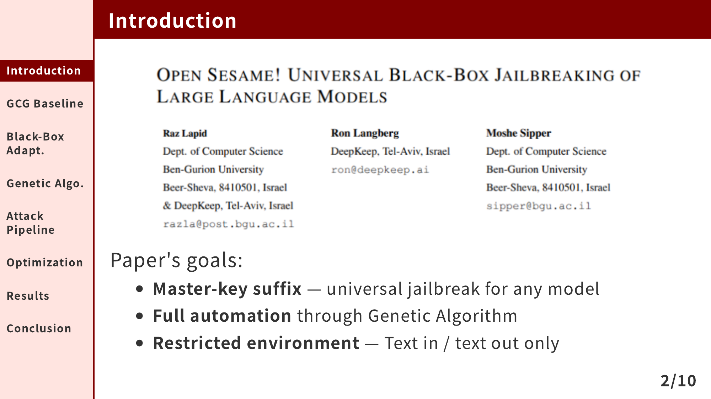

# marp-theme-academic-progression

A Marp theme extending [marp-theme-academic](https://github.com/kaisugi/marp-theme-academic) with an optional sidebar table of contents, refined typography, and no-inline-CSS slide highlighting.



---

## Features

- **Sidebar TOC** — vertical table of contents on every content slide, defined once in frontmatter
- **Active slide highlighting** — mark the current section with `_class: toc-N`, no inline CSS needed
- **Custom classes** — `lead` (title/Q&A), `fill-image` (image fills slide), `no-sidebar` (full-width slide), `small-text` (paragraphs match list size), `toc-N` (highlight sidebar item)
- **Refined typography** — lists have more breathing room, paragraphs hug their lists, tables are centered and scaled
- **Untouched academic base** — `themes/academic.css` is the original, unmodified academic theme

## Quick Start

### 1. Set up your presentation

```yaml
---
marp: true
theme: academic-progression
paginate: true
math: katex
footer: '**Introduction**
**GCG Baseline**
**Results**
**Conclusion**'
---
```

Each `**item**` in the footer becomes a TOC entry in the sidebar.

### 2. Highlight the current slide

Add a `toc-N` class to each content slide. The number matches the item's position in the footer (1-based):

```markdown
<!-- _class: toc-2 -->
```

Combine with other classes: `<!-- _class: toc-5 fill-image no-sidebar -->`, `<!-- _class: toc-8 small-text -->`. No `<style>` tags, no inline CSS — pure Marp directives.

### 3. Build

```bash
marp --allow-local-files \
  --theme-set themes/academic.css \
  --theme-set themes/academic-progression.css \
  --theme academic-progression \
  your-slides.md -o output.pdf
```

> [!IMPORTANT]
> Both `--theme-set` flags are required. The theme imports `academic` which imports `gaia`. Using only `--theme` causes the import chain to fail silently — the sidebar renders but fonts, colors, and base layout are missing.

### 4. Export to PowerPoint

```bash
# Flat PNG slides (not editable)
marp --allow-local-files \
  --theme-set themes/academic.css \
  --theme-set themes/academic-progression.css \
  --theme academic-progression \
  --pptx your-slides.md -o output.pptx

# Editable (requires LibreOffice)
marp --allow-local-files \
  --theme-set themes/academic.css \
  --theme-set themes/academic-progression.css \
  --theme academic-progression \
  --pptx --pptx-editable your-slides.md -o output.pptx
```

## Slide Classes

| Class        | Directive                     | Effect                                                                        |
| ------------ | ----------------------------- | ----------------------------------------------------------------------------- |
| `lead`       | `<!-- _class: lead -->`       | Title/Q&A slide. Sidebar hidden, crimson centered heading, full-width layout. |
| `fill-image` | `<!-- _class: fill-image -->` | Image fills the entire slide content area using flexbox.                      |
| `no-sidebar` | `<!-- _class: no-sidebar -->` | Hide sidebar on a single slide. Restores full-width layout.                   |
| `small-text` | `<!-- _class: small-text -->` | Shrink paragraphs to match list font size (0.85em).                           |
| `toc-N`      | `<!-- _class: toc-3 -->`      | Highlight the Nth TOC item (1-indexed). Supports `N` = 1–12. Combine: `<!-- _class: toc-6 small-text -->`. |

> [!WARNING]
> Marp only honors the **last** `_class:` directive per slide. Stack all classes on ONE line. Two separate directives silently discard the first.

Combine classes with spaces: `<!-- _class: fill-image no-sidebar toc-5 -->`

## Configuration

### Sidebar width

Edit `width` in `themes/academic-progression.css` (default: 170px) and update `section` `padding-left` to match (width + 28px gap).

### Sidebar color

```css
:root {
    --color-background: #ffe4e0; /* warm beige, change to any color */
}
```

### Per-slide header

```markdown
<!-- _header: Section Name -->
```

Displays a crimson bar at the top. Independent from the sidebar — you can use different text in each or align them.

## Example

See `demo.md` for a complete 10-slide presentation about "Automated Black-Box Jailbreaking of LLMs via Genetic Algorithms." Built demo: `demo.pdf`.

## Files

```
marp-theme-academic-progression/
├── themes/
│   ├── academic.css                 # original, untouched
│   └── academic-progression.css     # sidebar theme (~110 lines)
├── demo.md                          # full presentation
├── demo.pdf                         # pre-built example
├── images/                          # screenshots and assets
└── README.md
```

## Troubleshooting

**Sidebar shows but fonts/colors are wrong** — You used `--theme` instead of both `--theme-set` flags. The `@import "academic"` chain failed. Output PDF will be ~300KB instead of ~470KB+. Always use: `--theme-set themes/academic.css --theme-set themes/academic-progression.css --theme academic-progression`.

**TOC highlighting not working** — (1) Verify the `toc-N` number matches the footer item's position (1-based). (2) Check for a later `_class:` directive on the same slide — only the last one applies (see warning above).

**PPTX text is too small or uneditable** — Marp PPTX renders slides as flat PNG screenshots by default. Text is not editable. Use `--pptx-editable` with LibreOffice for native text, but fidelity may be lower.

**Google Fonts not loading offline** — The academic theme imports Noto Sans JP and Source Code Pro from Google Fonts. Offline builds fall back to system fonts. Download the fonts and change `@import url(...)` to local `@font-face` declarations for offline use.

## License

Based on [marp-theme-academic](https://github.com/kaisugi/marp-theme-academic) by kaisugi (MIT). This fork is also MIT.
