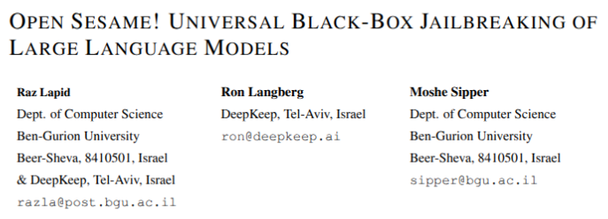
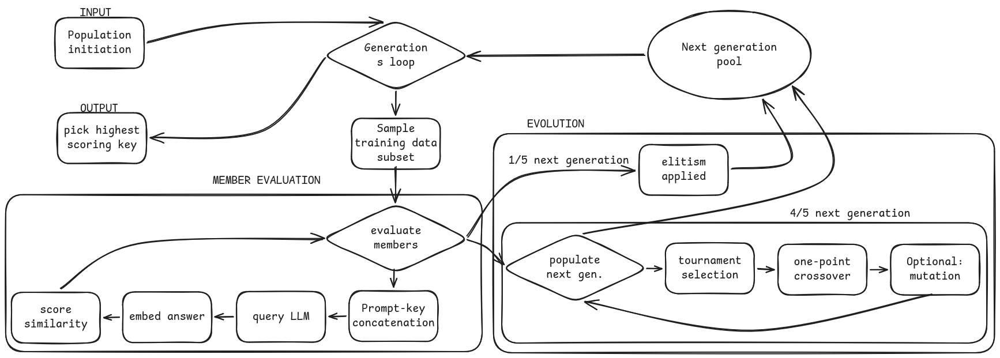

<!-- _class: lead -->
<!-- _footer: "" -->

# Automated Black-Box Jailbreaking of LLMs via Genetic Algorithms

 

**@Josph27**
LLM Security
2026

---

<!-- _header: Introduction -->
<!-- _class: toc-1 -->

Paper's goals:

- **Master-key suffix** — universal jailbreak for any model
- **Full automation** through Genetic Algorithm
- **Restricted environment** — Text in / text out only

---

<!-- _header: GCG - industry standard -->
<!-- _class: toc-2 -->

Greedy Coordinate Gradient (GCG) - Zhou et al. 2023

- **Define** target response (eg. "Yes, here's a...")

- **Initiate** master-key token sequence

- **Compute** gradients pointing towards the target response for each token.

- **Greedily select** top token swaps based on the gradient.

- **Evaluate** swaps through forward passes and probability.

- **Iterate** until the probability is high enough.

GCG requires **white-box access** — gradients and log response probability distribution.

---

<!-- _header: Black-Box Adaptation -->
<!-- _class: toc-3 -->

- Negative log-likelihood is unavailable — no gradient information.

**How the GA solves this through fitness approximation:**

- Measure _"closeness"_ to desired response via **semantic similarity** instead of likelihood.
- Embed responses and targets into a shared **vector space**
- compute **cosine similarity**:
  $$\text{cos}(\vec{a}, \vec{b}) = \frac{\vec{a} \cdot \vec{b}}{\|\vec{a}\| \cdot \|\vec{b}\|}$$

---

<!-- _header: Genetic Algorithm -->
<!-- _class: toc-4 -->

1. **Population initiation algorithm** — random token sequences
2. **Fitness function** — cosine similarity
3. **Parents selection** - tournament selection ($k = 2$)
4. **Offspring Generation**:

- **Elitism** — $\lambda = 1/5$ preserved directly into the next generation.
- One-point token-sequence crossover.
- Token-wise mutation.

---

<!-- _header: Attack Pipeline -->
<!-- _class: toc-5 fill-image no-sidebar -->

---

<!-- _header: Optimizing hyperparameters, Target models -->
<!-- _class: toc-6 small-text -->

| Component                 | Tested Values             |
| :------------------------ | :------------------------ |
| **Target Models**         | LLaMA2-7b-chat, Vicuna-7b |
| **Sentence Embedders**    | BGE, MPNet, MiniLM        |
| **Population Size ($n$)** | 10, 20, 30                |
| **Suffix Length ($m$)**   | 20, 40, 60 tokens         |
| **Generations ($g$)**     | 100                       |
| **Fitness Subset ($c$)**  | 50 prompts per generation |

**Compute per key:**

- $(10/20/30) \times 100 \times 50 = (50 000/ 100 000/ 150 000)$ API calls

**Complexity:**

- actually very efficient compared to GCG

---

<!-- _header: Results -->
<!-- _class: toc-7 -->

| Target Model  | $n$ | Embedder | Baseline | ASR ($m=20$) | ASR ($m=40$) | ASR ($m=60$) |
| :------------ | :-: | :------- | :------: | :----------: | :----------: | :----------: |
| **LLaMA2-7b** | 10  | MPNet    |  16.3%   |    99.4%     |  **99.7%**   |    98.4%     |
| **Vicuna-7b** | 10  | MPNet    |   0.6%   |    97.1%     |  **98.4%**   |    97.1%     |
| **LLaMA2-7b** | 30  | BGE      |  16.3%   |    99.4%     |    97.8%     |    99.0%     |
| **Vicuna-7b** | 30  | BGE      |   0.6%   |    96.5%     |    92.3%     |    94.6%     |
| **LLaMA2-7b** | 30  | MiniLM   |  16.3%   |    99.4%     |    98.4%     |    98.1%     |
| **Vicuna-7b** | 30  | MiniLM   |   0.6%   |    95.5%     |    97.4%     |    94.2%     |

    Similar model architectures

    Shorter token lengths perform better overall

---

<!-- _header: Conclusion -->
<!-- _class: toc-8 small-text -->

Clear signal: **weight-level alignment is insufficient.**

Required defense methods

- **Perplexity Filtering** — detect anomalous token sequences at inference time.
- **Semantic Guardian Models** — secondary classifiers evaluating query intent.
- **Token Smoothing** — disrupt adversarial token patterns via controlled noise.

LLM security beyond public harm: **distillation attacks defense**

Good example: **Claude Fable** hypersensitive evaluation with escalation for deep query-intent classification.

---

<!-- _class: lead -->
<!-- _footer: "" -->

# Q & A

 

**Automated Black-Box Jailbreaking of LLMs via Genetic Algorithms**
Lapid et al., Ben-Gurion University
